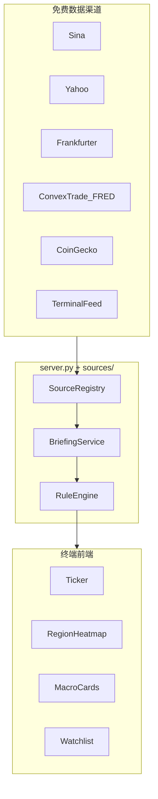

# MarketRadar · 全球行情读卡器

面向创业竞赛的 **免费全球市场行情终端**：30 秒扫读汇率、股指、宏观、商品、加密与规则简报。  
Python 轻量后端多源融合 + 原生前端终端式布局，支持本地运行与云端零成本部署。

---

## 竞赛陈述（答辩用）

### 痛点

- Bloomberg / 机构终端昂贵，学生与小团队难以获得**高密度、跨资产、可解释**的市场读卡体验
- 免费数据散落在 Sina、Yahoo、FRED、CoinGecko 等渠道，**缺乏统一清洗、缓存与降级**
- 个人看板工具信息维度窄，难以在答辩中展示「渠道 + 技术 + 产品」完整闭环

### 方案

**MarketRadar = Market Briefing Terminal（市场读卡器）**

- 一次 `/api/briefing` 拉取全球快照：区域涨跌、宏观利率、VIX、商品、加密、规则要点、快讯标题
- **SourceRegistry** 统一注册 8+ 免费频道，TTL 分级缓存，来源与延迟透明展示
- 终端式 UI：滚动行情带、区域热力、宏观卡片、跨资产观察列表
- **规则引擎** 生成「今日 3 条要点」（可解释，非黑盒 AI）

### 技术壁垒

| 能力 | 实现 |
|------|------|
| 多源融合 | `sources/` 模块 + `SourceRegistry` |
| 分级缓存 | 行情 20s / 宏观 1h / 快讯 5min |
| 容错降级 | Sina → Stooq → Yahoo；Frankfurter → Currency API → 内置参考值 |
| 可扩展配置 | [`market-config.json`](market-config.json) 资产组 + 20 全球指数 |
| 云原生 | [`render.yaml`](render.yaml) 一键部署；[`_redirects`](_redirects) 支持 Pages 反代 |

### Demo 路径（建议答辩脚本）

1. 打开在线 Demo / 本地 `http://127.0.0.1:18765`
2. 顶部 **Ticker** 自动滚动：股指 + 宏观 + 加密 + 汇率
3. **今日要点** 展示规则引擎输出的 3 条解读
4. 点击 **区域热力** 过滤亚太 / 欧美指数
5. 在观察列表点击指数 → 展开 **K 线详情**
6. 展示 `/api/sources` 频道健康状态

---

## 功能概览

- **全球简报终端**：Ticker、区域热力、宏观/商品/加密卡片、跨资产观察列表
- **20 全球指数** + 12 核心汇率（可扩展至 30 币种展示）
- **宏观频道**：美国 10Y/2Y、利差、联邦基金利率（ConvexTrade / FRED 代理）
- **商品频道**：黄金、原油、白银、天然气（Yahoo）
- **加密频道**：BTC/ETH（CoinGecko）+ 恐惧贪婪指数
- **规则简报**：VIX、收益率曲线、区域涨跌、BTC 异动等可解释规则
- 换汇计算、3D 地球市场时钟、指数 K 线详情（保留）

---

## 系统架构



---

## 快速开始

### Windows

双击 `run.bat` 或 `启动金融小助手.bat`，访问：

```text
http://127.0.0.1:18765
```

### Linux / macOS

```bash
python3 server.py
```

### 云端部署（Render 免费层）

详见 [`deploy/cloudflare-pages.md`](deploy/cloudflare-pages.md) 与 [`render.yaml`](render.yaml)。

```bash
# 环境变量
HOST=0.0.0.0
PORT=10000   # Render 自动注入
```

**在线 Demo（部署后填写）：** `https://<your-service>.onrender.com`

---

## API 接口

| 路径 | 说明 |
|------|------|
| `GET /api/briefing` | 全球快照：要点、区域、宏观、商品、加密、快讯 |
| `GET /api/sources` | 数据频道健康与 TTL 元信息 |
| `GET /api/quotes?group=rates` | 按资产组拉取报价 |
| `GET /api/fx?base=USD` | 汇率 |
| `GET /api/indices` | 全球指数 |
| `GET /api/trends?mode=intraday` | 指数趋势 |
| `GET /api/health` | 健康检查 |
| `GET /api/config` | 市场配置 |

---

## 数据源清单

| 频道 | 来源 | 用途 | 缓存 |
|------|------|------|------|
| 全球股指 | Sina / Stooq / Yahoo | 20 指数 | 20s |
| 外汇 | Frankfurter / Currency API | 多币种 | 20s |
| 宏观利率 | ConvexTrade FRED 代理 | DGS10/DGS2/T10Y2Y/EFFR | 1h |
| 波动率 | Convex + Yahoo ^VIX | 风险情绪 | 1h / 20s |
| 大宗商品 | Yahoo GC=F/CL=F 等 | 金油银气 | 20s |
| 加密 | CoinGecko | BTC/ETH | 60s |
| 恐惧贪婪 | Alternative.me | 加密情绪 | 5min |
| 快讯标题 | TerminalFeed | 标题链接 | 5min |

> 免费源存在延迟与限流（如 Convex 200 次/天/IP）。界面角标展示来源与延迟秒数。

---

## 项目结构

```text
financial_assistant/
├── market-config.json      # 资产组 + 指数 + 币种
├── server.py               # HTTP 服务入口
├── sources/                # 多源 adapter + 规则引擎
│   ├── registry.py
│   ├── briefing.py
│   ├── macro.py
│   ├── crypto.py
│   └── rules.py
├── index.html / app.js / styles.css
├── render.yaml             # Render 部署
├── deploy/                 # 云端部署说明
└── run.bat / run.ps1
```

---

## 扩展指南

编辑 [`market-config.json`](market-config.json)：

- `indexSymbols`：新增指数（含 `region`、`stooq`、`sina` 等字段）
- `assetGroups`：新增宏观/商品/加密条目（`provider`: `yahoo` | `convex` | `coingecko`）
- `coreCurrencies`：API 校验所需的核心币种列表

重启 `server.py` 后刷新页面。

---

## 免责声明

MarketRadar 仅用于学习、竞赛演示与信息参考，**不构成**任何投资、交易或换汇建议。  
规则引擎输出为基于公开数据的启发式解读，请勿作为唯一决策依据。
