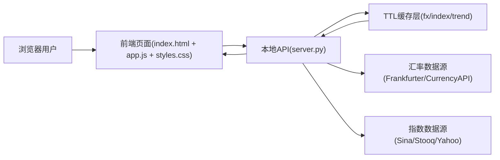
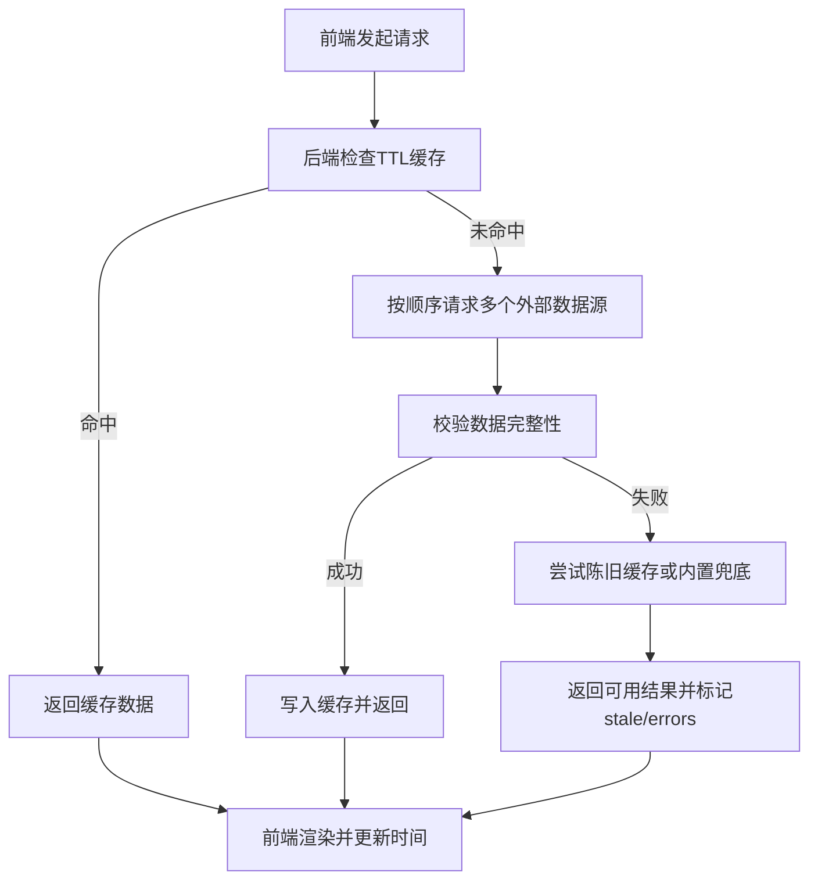

# 金融小助手（Financial Assistant）

一个面向日常金融信息查看的本地 Web 工具，提供 **汇率、全球指数、趋势图、换汇计算、市场时钟** 等能力。  
项目采用 **Python 轻量后端 + 原生 HTML/CSS/JavaScript 前端**，后端统一对接外部数据源并做缓存与降级，前端只请求本地 API，使用简单、启动快速。

## 功能概览

- 常用货币汇率展示（支持基准货币切换）
- 换汇计算（金额、币种互换）
- 全球主要指数总览（价格、涨跌、涨跌幅、更新时间）
- 指数分时 / 日K / 月K 趋势
- 全球市场时钟与交互地球视图
- 自动刷新（默认 20 秒）与手动刷新
- 公开数据源异常时的缓存兜底与多源切换

## 技术栈

- 后端：Python 标准库（`http.server`、`urllib`、`threading` 等）
- 前端：原生 JavaScript + HTML + CSS
- 数据形态：REST 风格 JSON API
- 运行环境：Windows（优先），可使用便携 Python 或系统 Python

## 系统架构图



## 数据请求流程图



## 快速开始（Windows）

### 方式一：双击启动（推荐）

在项目目录双击以下任一脚本：

- `run.bat`
- `启动金融小助手.bat`

启动后访问：

```text
http://127.0.0.1:18765
```

### 方式二：PowerShell 启动

```powershell
powershell -ExecutionPolicy Bypass -File .\run.ps1
```

说明：直接执行 `.\run.ps1` 在部分系统上可能受默认执行策略限制。

### Python 选择逻辑

`run.ps1` 会按以下优先级选择 Python：

1. 项目内便携 Python：`.python\python.exe`
2. 系统 `python`
3. 系统 `py`

若都不存在，会提示安装 Python 3.12+ 或放置便携 Python。

## 使用说明

### 1) 汇率看板

- 默认以 `USD` 为基准，支持切换为 `CNY/EUR/JPY/...`
- 若单次请求失败，后端会尝试其他汇率源
- 若全部失败，优先返回最近缓存；再失败则返回内置参考值

### 2) 换汇计算

- 输入金额，选择“从/到”币种
- 支持一键交换币种
- 结果随汇率刷新自动更新

### 3) 全球指数

- 覆盖美股、欧股、亚太等核心指数
- 支持分时 / 日K / 月K 三种趋势模式
- 指数详情中可直接打开对应数据来源链接

### 4) 全球市场时钟

- 地球视图支持拖拽旋转
- 点击市场光点查看对应城市时间
- 便于跨时区观察主要市场交易时段

## API 接口

### `GET /api/fx?base=USD`

- 说明：获取指定基准货币的汇率快照
- 参数：
  - `base`：可选，基准币种（默认 `USD`）
- 返回要点：
  - `ok`、`base`、`rates`、`source`、`timestamp`
  - 失败降级时可能出现 `stale`、`errors`

### `GET /api/indices`

- 说明：获取全球主要指数列表
- 返回要点：
  - `ok`
  - `indices`（含 `symbol/name/price/change/changePercent/updatedAt/source` 等字段）

### `GET /api/trends?mode=intraday&symbols=^GSPC,^IXIC`

- 说明：获取指数趋势数据
- 参数：
  - `mode`：`intraday` / `daily` / `monthly`
  - `symbols`：可选，逗号分隔的指数代码过滤
- 返回要点：
  - `ok`、`mode`、`trends`

### `GET /api/health`

- 说明：健康检查与数据可用性摘要
- 返回要点：
  - `ok`
  - `fxSource`
  - `indicesLive` / `indicesTotal`
  - `autoRefreshSeconds`

## 数据源与容错策略

### 汇率数据源

- Frankfurter
- Currency API（CDN）
- Currency API（Cloudflare）

### 指数数据源

- 新浪（优先）
- Stooq（批量兜底）
- Yahoo Finance（最终兜底）

### 容错与缓存

- 默认缓存周期：20 秒（趋势数据缓存更长）
- 多数据源顺序尝试，单源失败自动切换
- 可用旧缓存优先返回，避免前端空白
- 最终可退回内置参考汇率，保证页面可用

## 项目结构

```text
financialAssistant/
├─ index.html                  # 页面结构
├─ styles.css                  # 样式
├─ app.js                      # 前端交互与渲染
├─ server.py                   # 本地HTTP服务与数据聚合
├─ run.bat                     # 一键启动（CMD）
├─ run.ps1                     # 一键启动（PowerShell）
├─ 公开访问金融小助手.bat         # Cloudflare Quick Tunnel 临时公网访问
├─ .python/                    # 可选：便携 Python
└─ world-land-10m.json         # 地球高精度地理数据
```

## 公网访问（临时）

运行 `公开访问金融小助手.bat` 后，会得到一个 `https://xxxx.trycloudflare.com` 临时链接。  
将该链接分享给他人，即可远程访问你本机正在运行的服务。

注意事项：

- 链接仅在本机服务与隧道窗口都在线时有效
- 关闭窗口后链接失效
- 当前项目无登录鉴权，不建议暴露敏感数据

## 常见问题（FAQ）

### Q1：页面打开但没有数据？

- 先看状态条是否提示数据源异常
- 调用 `http://127.0.0.1:18765/api/health` 检查健康状态
- 网络受限时可能仅返回缓存或兜底数据

### Q2：为什么和券商软件数据有差异？

- 本项目使用免费公开源，存在延迟与采样差异
- 不同平台统计口径、时区、刷新频率不同

### Q3：启动脚本报 Python 不存在？

- 放置 `.python\python.exe`（便携版）
- 或安装系统 Python 3.12+ 并确保命令行可用

## 开发建议

- 前端调试：直接修改 `app.js` / `styles.css` / `index.html`
- 后端调试：修改 `server.py` 后重启服务
- 若要扩展市场/币种，可在前后端常量中同步新增配置项

## 免责声明

本项目仅用于学习、演示与信息参考，不构成任何投资、交易、换汇或资产配置建议。  
请勿基于本工具结果直接做出交易决策；由此产生的任何损失由使用者自行承担。
