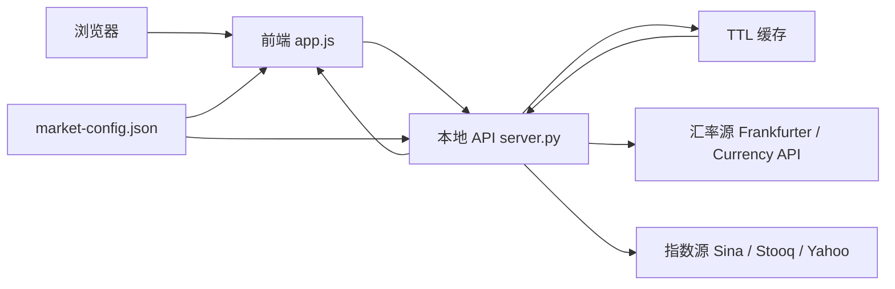

# 金融小助手（Financial Assistant）

一个面向日常金融信息查看的本地 Web 工具，提供 **汇率、全球指数、趋势图、换汇计算、市场时钟** 等能力。  
项目采用 **Python 轻量后端 + 原生 HTML/CSS/JavaScript 前端**：后端统一对接外部数据源并做缓存与降级，前端只请求本地 API，使用简单、启动快速。

---

## 项目分析

### 定位与特点

| 维度 | 说明 |
|------|------|
| 使用场景 | 个人桌面查看汇率与全球主要指数，非专业交易系统 |
| 部署方式 | 本地单机运行，可选 Cloudflare Quick Tunnel 临时公网分享 |
| 数据性质 | 免费公开源，存在延迟；异常时回退缓存或内置参考值 |
| 交互亮点 | 暗色/浅色主题、红绿涨跌习惯切换、3D 地球市场时钟、指数详情 K 线 |

### 模块职责

```text
market-config.json   共享市场配置（币种、指数、兜底汇率、刷新周期）
server.py            HTTP 服务、多源抓取、TTL 缓存、JSON API
app.js               页面渲染、地球可视化、浏览器直连兜底
index.html           页面结构
styles.css           主题与响应式样式
world-land-10m.json  Natural Earth 1:10m 陆地拓扑（地球渲染）
run.bat / run.ps1    跨平台本地启动脚本
```

### 数据流概览



---

## 功能概览

- 常用货币汇率展示（支持基准货币切换）
- 换汇计算（金额、币种互换）
- 全球主要指数总览（价格、涨跌、涨跌幅、更新时间）
- 指数分时 / 日K / 月K 趋势
- 全球市场时钟与交互地球视图（Natural Earth 1:10m）
- 自动刷新（默认 20 秒，可在 `market-config.json` 调整）与手动刷新
- 公开数据源异常时的缓存兜底与多源切换

---

## 技术栈

- 后端：Python 标准库（`http.server`、`urllib`、`threading` 等）
- 前端：原生 JavaScript + HTML + CSS
- 配置：JSON（`market-config.json`）
- 运行环境：Windows（优先），亦可在 Linux / macOS 用系统 Python 启动

---

## 快速开始

### Windows（推荐）

在项目目录双击以下任一脚本：

- `run.bat`
- `启动金融小助手.bat`（调用 `run.bat`）

或使用 PowerShell：

```powershell
powershell -ExecutionPolicy Bypass -File .\run.ps1
```

启动后访问：

```text
http://127.0.0.1:18765
```

### Linux / macOS

```bash
python3 server.py
# 或指定端口
python3 server.py 18765
```

### Python 选择逻辑

启动脚本按以下优先级选择 Python：

1. 项目内便携 Python：`.python/python.exe`（Windows）
2. 系统 `python` / `python3`
3. 系统 `py`（Windows Python Launcher）

若都不存在，请安装 Python 3.12+ 或放置便携 Python。

---

## 使用说明

### 汇率看板

- 默认以 `USD` 为基准，可切换为 `CNY/EUR/JPY/...`
- 单次请求失败时，后端自动尝试其他汇率源
- 全部失败时，优先返回最近缓存；再失败则返回内置参考值

### 换汇计算

- 输入金额，选择「从 / 到」币种，支持一键交换
- 结果随汇率刷新自动更新

### 全球指数

- 覆盖美股、欧股、亚太等 10 个核心指数
- 支持分时 / 日K / 月K；点击行可展开详情图表
- 部分指数在公开 K 线不可用时，会用当日高低区间做兜底走势

### 全球市场时钟

- 地球视图支持拖拽旋转，点击市场光点选中城市
- 使用 `world-land-10m.json` 高精度陆地边界

---

## API 接口

| 方法 | 路径 | 说明 |
|------|------|------|
| GET | `/api/health` | 健康检查与数据可用性摘要 |
| GET | `/api/config` | 返回 `market-config.json` 内容 |
| GET | `/api/fx?base=USD` | 指定基准货币的汇率快照 |
| GET | `/api/indices` | 全球主要指数列表 |
| GET | `/api/trends?mode=intraday&symbols=^GSPC,^IXIC` | 指数趋势数据 |

### `GET /api/fx?base=USD`

- 参数：`base`（可选，默认 `USD`）
- 返回：`ok`、`base`、`rates`、`source`、`timestamp`；降级时可能有 `stale`、`errors`

### `GET /api/indices`

- 返回：`ok`、`indices[]`
- 单条字段：`symbol`、`name`、`zhName`、`price`、`change`、`changePct`、`updatedAt`、`source`、`detailUrl` 等

### `GET /api/trends`

- 参数：
  - `mode`：`intraday` / `daily` / `monthly`
  - `symbols`：可选，逗号分隔过滤
- 返回：`ok`、`mode`、`trends[]`（含 `points`、`quality`、`derived` 等）

### `GET /api/health`

- 返回：`ok`、`fxSource`、`indicesLive`、`indicesTotal`、`autoRefreshSeconds`

---

## 数据源与容错

### 汇率

Frankfurter → Currency API（CDN）→ Currency API（Cloudflare）→ 陈旧缓存 → 内置参考值

### 指数

Sina（优先）→ Stooq（批量兜底）→ Yahoo Finance（最终兜底）

### 趋势

- 分时：A 股指数优先 Sina 5 分钟 K 线；其余指数用当日区间兜底
- 日K / 月K：Sina 日线；月K 由日线聚合；不可用时区间兜底

### 缓存

- 汇率 / 指数：20 秒（与 `autoRefreshSeconds` 一致）
- 趋势：180 秒

---

## 项目结构

```text
financialAssistant/
├── market-config.json         # 共享配置（币种、指数、兜底汇率）
├── index.html                 # 页面结构
├── styles.css                 # 样式
├── app.js                     # 前端交互与渲染
├── server.py                  # 本地 HTTP 服务与数据聚合
├── run.bat                    # Windows 一键启动（CMD）
├── run.ps1                    # Windows 一键启动（PowerShell）
├── 启动金融小助手.bat           # 调用 run.bat
├── 公开访问金融小助手.bat        # Cloudflare Quick Tunnel 临时公网访问
├── world-land-10m.json        # 地球高精度地理数据
└── .python/                   # 可选：便携 Python（Windows）
```

---

## 扩展与开发

### 新增币种或指数

只需编辑 **`market-config.json`**：

- `currencies`：增加 `{ "code": "...", "name": "..." }`
- `indexSymbols`：增加指数元数据；后端字段如 `sina` / `sinaGlobal` / `stooq` 供抓取使用，前端会忽略未知字段
- 修改后重启 `server.py`，刷新浏览器即可

### 本地调试

- 前端：改 `app.js` / `styles.css` / `index.html`，刷新页面
- 后端：改 `server.py` 或 `market-config.json` 后重启服务
- 健康检查：`curl http://127.0.0.1:18765/api/health`

### 前端无后端时的行为

若直接用浏览器打开 `index.html`（`file://`），前端会：

1. 读取 `/market-config.json`（需本地静态服务）
2. 直连 Frankfurter / Stooq / Yahoo 等公开 API

因此 **推荐始终通过 `server.py` 访问**，以获得完整功能与更稳定的指数源（Sina）。

---

## 公网访问（临时）

运行 `公开访问金融小助手.bat` 前，需将 [cloudflared](https://developers.cloudflare.com/cloudflare-one/connections/connect-networks/downloads/) 放到项目根目录。

脚本会启动（或复用）本地服务，并生成 `https://xxxx.trycloudflare.com` 临时链接。

注意：链接仅在服务与隧道窗口在线时有效；项目无登录鉴权，请勿暴露敏感信息。

---

## 常见问题

**页面打开但没有数据？**  
查看状态条提示；访问 `/api/health`；网络受限时可能只有缓存或兜底数据。

**与券商软件数据不一致？**  
免费公开源有延迟，各平台统计口径、时区、刷新频率不同。

**启动脚本报 Python 不存在？**  
安装 Python 3.12+，或在 Windows 放置 `.python/python.exe`。

**配置加载失败？**  
确认 `market-config.json` 与 `server.py` 同目录，且通过 HTTP 访问（非直接双击 HTML）。

---

## 免责声明

本项目仅用于学习、演示与信息参考，**不构成**任何投资、交易、换汇或资产配置建议。  
请勿基于本工具结果直接做出交易决策；由此产生的任何损失由使用者自行承担。
