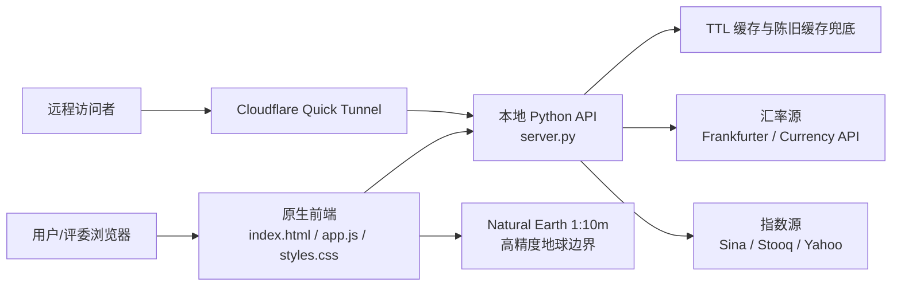

# 金融小助手比赛版技术设计文档

## 1. 产品定位

金融小助手是一个面向比赛演示和日常金融信息查看的轻量级 Web 产品。它把常用汇率、全球主要指数、指数趋势图、换汇计算、全球市场时钟和交互式地球集中到一个页面中，目标是让用户在几秒内完成“看市场、看时间、看来源、做换算”的核心动作。

本项目的设计原则是：

- **零成本可公开演示**：本地 Python 服务运行，Cloudflare Quick Tunnel 生成临时公网链接。
- **真实优先，透明兜底**：优先请求公开真实数据源；失败时展示缓存、兜底或不可用状态，不伪装为交易级实时数据。
- **高性能低依赖**：前端不使用构建工具和重型框架，后端使用 Python 标准库，启动快、部署简单。
- **比赛可解释**：每个核心能力都有明确架构、数据流、降级策略和可验证指标。

## 2. 总体架构

系统由三层组成：

### 前端职责

- 渲染金融看板、汇率卡片、换汇计算、指数表格、图表详情和全球时钟。
- 调用本地 API，不直接暴露复杂跨域数据源逻辑。
- 使用 `requestAnimationFrame` 驱动地球动画和渲染调度。
- 使用 `localStorage` 保存主题、涨跌颜色习惯、基准货币、趋势模式和最近成功数据。

### 后端职责

- 对接外部公开金融数据源。
- 做接口超时、重试、缓存、陈旧缓存兜底和数据标准化。
- 统一返回市场时区、北京时间、数据质量、缓存状态和来源链接。
- 提供 `/api/diagnostics` 供比赛现场检查服务健康。

## 3. API 设计

### `GET /api/fx?base=CNY`

返回指定基准货币下的常用汇率。

关键字段：

- `base`：基准货币。
- `rates`：目标货币到基准货币的汇率表。
- `source` / `sourceUrl`：计算数据源。
- `officialSourceUrl`：官方展示页参考入口。
- `cacheState`：`live`、`fresh`、`stale`、`fallback`。
- `quality`：`real`、`cache`、`fallback`。
- `latencyMs`：本次接口处理耗时。
- `beijingUpdatedAt`：更新时间换算后的北京时间。

### `GET /api/indices`

返回全球主要指数快照。覆盖美股、欧洲、日韩、香港、A 股等市场。

关键字段：

- `name` / `zhName`：英文名和中文名。
- `symbol`：指数代码。
- `price`、`change`、`changePct`：最新价格、涨跌和涨跌幅。
- `updatedAt`、`timeZone`、`timeZoneLabel`、`beijingUpdatedAt`：原始市场时间和北京时间。
- `quality`：`real`、`delayed`、`cache`、`unavailable`。
- `sourceDetailUrl`：官方详情页或权威参考页。

### `GET /api/trends?mode=intraday|daily|monthly&symbols=...`

返回指数走势图数据。

关键字段：

- `mode`：分时、日 K 或月 K。
- `points`：价格点或 OHLC 点。
- `quality`：真实 K 线、兜底区间或缓存。
- `fallbackReason`：无法取得真实 K 线时的说明。
- `marketTimeZone`、`beijingUpdatedAt`：时间解释字段。

### `GET /api/diagnostics`

比赛版新增诊断接口，用于确认演示现场状态。

返回内容：

- 应用版本、启动时间、服务端 UTC 时间、北京时间。
- 汇率、指数、趋势缓存的 TTL、年龄和状态。
- 外部数据源的成功次数、失败次数、最近成功时间、最近失败错误和耗时。
- 公网演示模式、启动脚本、高精度地球资源和缓存策略。

## 4. 数据源与可信度策略

### 汇率

汇率计算优先使用：

1. Frankfurter
2. Currency API CDN
3. Currency API Cloudflare
4. 最近成功缓存
5. 内置参考汇率兜底

用户点击汇率卡片时，不跳转 API 站点，而是跳转更权威的官方展示页面：

- 包含 CNY 的货币对：跳转中国银行外汇牌价。
- 国际参考汇率：优先 ECB。
- 特定币种：跳转央行或监管机构页面。

### 指数

指数快照优先使用新浪公开行情源，补充 Stooq 和 Yahoo Chart 作为兜底。涨跌幅只使用同源字段，避免用错误基准自行推算。

数据质量标记规则：

- `real`：同源行情字段完整。
- `delayed`：公开源可能延迟。
- `cache`：网络失败，使用最近成功缓存。
- `fallback`：真实 K 线不可用，使用同源报价区间推导。
- `unavailable`：当前没有可信数据可展示。

## 5. 缓存与降级设计

后端使用轻量 TTL 缓存：

- 汇率缓存：20 秒。
- 指数缓存：20 秒。
- 趋势缓存：180 秒。

每个缓存都支持：

- **fresh**：TTL 内直接返回。
- **live**：刚从外部数据源获取。
- **stale**：外部源失败时返回陈旧缓存。
- **fallback**：无缓存时返回内置或区间兜底。

这样可以避免 20 秒自动刷新造成请求风暴，也能保证弱网环境下页面不空白。

## 6. 3D 地球设计

地球使用原生 Canvas 渲染，不依赖在线 3D CDN。核心数据来自 `world-land-10m.json`，即 Natural Earth 1:10m 级别陆地边界。

渲染流程：

1. 加载 TopoJSON 地理数据。
2. 解码 arc，拼接陆地多边形。
3. 生成经纬度栅格 land mask 和 coast mask。
4. 使用正射投影把经纬度映射到屏幕圆面。
5. 绘制海洋渐变、经纬网、陆地、海岸线、城市光点和市场连线。
6. 每帧根据旋转角度重绘，支持拖拽、惯性和自动轻微旋转。

交互能力：

- 鼠标或触控拖拽旋转。
- 点击城市光点选中市场。
- 点击空白取消选中。
- 选中后 tooltip 实时显示城市、市场、时区、日期和读秒时间。
- 时钟卡片和地球光点双向联动。

性能设计：

- 通过 `requestAnimationFrame` 控制帧率。
- 页面隐藏时暂停或降低动画负载。
- 支持 `prefers-reduced-motion`。
- Canvas 使用设备像素比进行高清渲染。

## 7. 图表系统

指数支持三种图表模式：

- **分时**：适合看当天或最近交易时段。
- **日 K**：适合看阶段趋势。
- **月 K**：适合看长期走势。

前端使用原生 SVG 生成走势图和 K 线图：

- 小图用于表格快速扫描。
- 点击指数行打开详情大图。
- hover/touch tooltip 展示时间、价格、OHLC、数据质量和北京时间。
- 图表模式全局切换与详情切换同步。

## 8. UI 与体验设计

比赛版 UI 采用高密度金融终端风格：

- 暗色/浅色主题。
- 红涨绿跌/绿涨红跌可切换。
- 卡片、表格和图表保持简洁、稳定、可扫描。
- 状态条展示刷新状态、更新时间、数据来源和演示可信度。
- 动画使用 `transform`、`opacity` 和原生 SVG 动画，避免布局抖动。

## 9. 公开访问方案

项目采用 Cloudflare Quick Tunnel：

1. 本机启动 Python 服务：`http://127.0.0.1:18765`
2. 运行 `公开访问金融小助手.bat`
3. 脚本检查本地服务、诊断接口和高精度地球资源。
4. 生成 `https://xxxx.trycloudflare.com` 临时链接。
5. 评委通过公网链接访问你的本机服务。

注意：

- 电脑不能关机。
- 本地服务窗口不能关闭。
- Cloudflare 隧道窗口不能关闭。
- 网络断开后链接失效。

## 10. 安全边界

- 本项目无登录、无用户账户、无支付、无个人数据保存。
- 公网链接仅用于演示，不建议长期暴露。
- 免费公开金融数据可能延迟，不作为投资建议。
- 页面和接口明确标注数据质量，避免误导为交易级终端。

## 11. 未来路线

后续可升级方向：

- 接入正式行情 API，提供 SLA 和更低延迟。
- 增加市场开闭市日历和交易时段高亮。
- 增加自选指数/自选货币。
- 增加 PWA 离线模式和最近成功快照。
- 增加一键导出比赛演示报告。
- 使用 WebGL 或本地 Three.js 进一步增强地球材质和光照。
