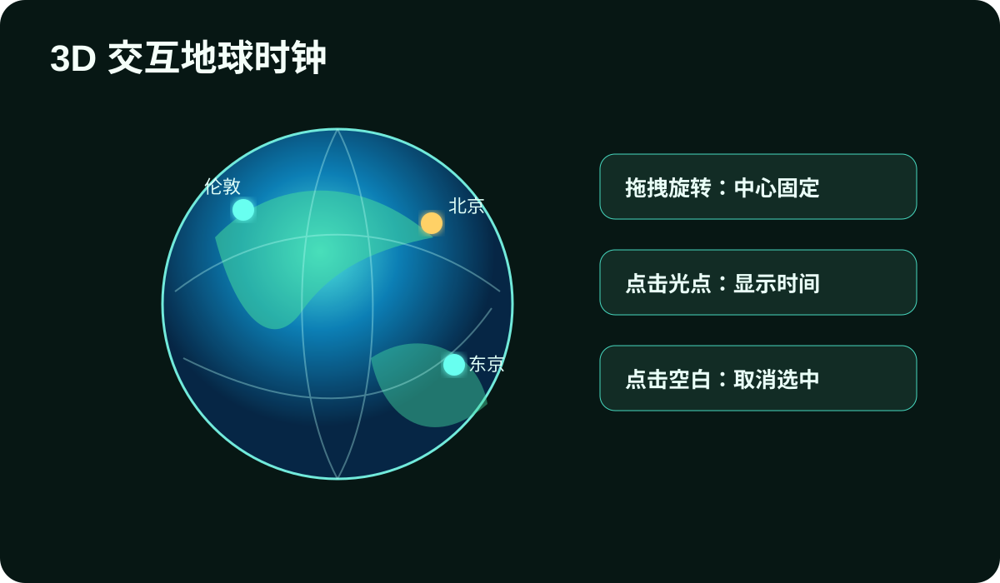
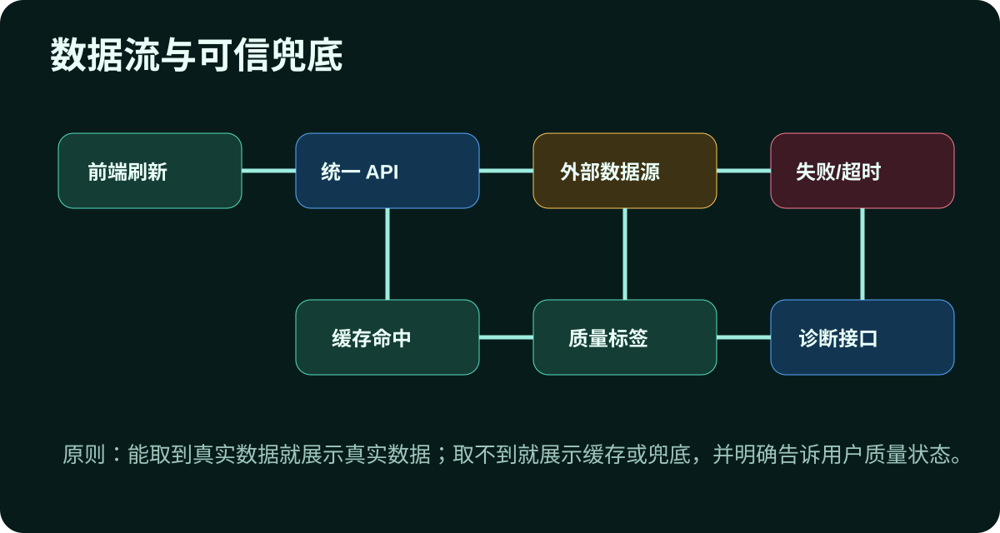

# 第十一届创新创业大赛作品赛作品情况表：金融小助手

## 作品名称

金融小助手：零成本公开访问的全球金融市场数据控制台

## 作者信息

组长：史健申。参赛队员保持为史健申、钟浩，指导老师为曹桂涛。

| 角色 | 院系 | 姓名 | 学号 | 信箱 | 电话 |
| --- | --- | --- | --- | --- | --- |
| 作者一 | 软件工程 | 史健申 | 10235101561 | 18130570903@163.com | 18130570903 |
| 作者二 | 软件工程 | 钟浩 | 10225101490 | 2177686531@qq.com | 19279985142 |

## 指导教师

曹桂涛，华东师范大学软件工程学院，021-62232557，gtcao@sei.ecnu.edu.cn

## 作品简介（约 200 字）

金融小助手面向普通用户、金融学习者和比赛展示场景，解决汇率、全球指数、跨时区市场时间和数据来源分散的问题。作品采用本地 Python 标准库后端与原生前端实现，提供汇率、换汇计算、全球主要指数、分时/日K/月K趋势图、3D 交互地球时钟、暗浅主题和红绿涨跌偏好。后端统一封装免费公开数据源，提供缓存、超时、失败兜底和 /api/diagnostics 诊断接口；前端明确展示实时、延迟、缓存、兜底等数据质量，并为汇率和指数提供官方来源跳转。作品支持双击本地启动，也可通过 Cloudflare Quick Tunnel 生成 0 成本公网链接，适合现场演示和快速分享。

## 作品安装说明

1. 在 Windows 环境进入项目目录，双击“启动金融小助手.bat”，或运行 `.\.python\python.exe server.py`。
2. 终端出现 `http://127.0.0.1:18765` 后，用现代浏览器打开该地址。
3. 若需要让其他人访问，双击“公开访问金融小助手.bat”，等待终端打印 `https://xxxx.trycloudflare.com`，把该链接发给评委或同学。
4. 公网链接依赖本机、网络、本地服务和 Cloudflare 窗口持续运行；关闭窗口或断网后链接失效。
5. 推荐使用支持 WebGL 的新版 Chrome、Edge 或 Firefox，以获得 3D 地球和图表的完整体验。

## 作品效果图与关键视觉

## 设计思路（可附图）

金融信息工具的核心不是把数字堆到页面上，而是回答用户最关心的几个问题：现在主要货币的汇率是多少，全球指数正在怎样变化，这个时间到底对应哪个市场，数据从哪里来，是否可靠，别人能不能直接访问我的作品。金融小助手从这些第一性问题出发，选择了“本地快速运行 + 免费公开数据源 + 明确质量标注 + 零成本公网演示”的路线。

产品层面，页面不是传统宣传首页，而是打开即可使用的金融控制台。顶部的全球主流市场时钟结合 3D 地球，把北京、纽约、伦敦、法兰克福、东京、香港等市场与真实时区联系起来。用户可以拖拽旋转地球，点击市场光点查看城市、市场、时区、日期和实时读秒时间；点击空白处取消选中；点击时钟卡片也会联动地球。这一设计把跨时区理解从文字换算变成空间交互，既有展示冲击力，也有实际使用价值。

汇率模块围绕“计算”和“核验”两条线设计。系统使用 Frankfurter 等免费公开源获取汇率数值，内部保留完整精度，前端根据货币和数量级自适应显示小数，避免小额汇率显示失真。用户点击汇率卡片时，页面不会跳转到 API 文档，而是优先打开中国银行外汇牌价、ECB 欧元参考汇率或相关央行页面。这样既保留了自动计算能力，又尊重金融数据应有的权威来源核验路径。

指数模块强调“同源字段”和“质量透明”。全球主要指数来自 Sina Finance、Stooq、Yahoo 等公开源适配器。早期版本曾出现指数点位正确但涨跌幅与来源页面不一致的问题，因此后端约束涨跌和涨跌幅只使用同一数据源返回字段，不用错误基准自行推算。每条指数记录都展示中文名、代码、最新点位、涨跌、涨跌幅、市场时间、北京时间和数据质量。趋势图支持分时、日 K、月 K 三种模式，拿不到稳定 K 线时明确显示缓存、延迟或兜底原因，避免把不确定数据包装成精确实时行情。

技术架构上，后端使用 Python 标准库实现 HTTP 服务，避免 node/npm 不可用导致的部署阻塞。服务端接口包括 `/api/fx`、`/api/indices`、`/api/trends`、`/api/health` 和 `/api/diagnostics`。其中 diagnostics 输出数据源最近成功时间、失败原因、缓存年龄、接口耗时和公开演示建议，使系统具备可观测性。前端采用原生 HTML/CSS/JavaScript，Three.js 本地 vendor 化，避免依赖 CDN。图表使用原生 SVG/Canvas 思路实现，减少包体和构建步骤。

稳定性方面，系统采用分层缓存和 stale-while-revalidate 思路。汇率与指数适合短缓存，趋势图因为历史数据更重而使用较长缓存。自动刷新间隔为 20 秒，既能保证演示反馈，又通过缓存、超时和请求合并避免请求风暴。当某个数据源短暂失败时，页面优先展示最近成功缓存并标注状态，而不是让整页崩溃。所有 HTML、JS、CSS 和 JSON 响应设置 no-store 或版本号策略，减少公开访问时别人看到旧资源的问题。

交互体验上，作品提供暗色和浅色模式，并支持红涨绿跌与绿涨红跌切换，尊重中西方金融颜色习惯差异。动画主要使用 transform、opacity、requestAnimationFrame 和 SVG 过渡，保证主题切换、卡片刷新、地球旋转和图表切换足够流畅。移动端布局控制地球高度、表格滚动和卡片间距，避免元素重叠。

创新创业价值上，本作品的亮点不是把某个单点技术包装成概念，而是在免费、低依赖、可公开演示、数据源有波动这些真实约束下做出完整系统。它可以服务金融学习、课堂展示、校园社团市场观察和小型研究讨论，也具备继续扩展到自选市场、学习卡片、风险提示、正式云部署和合规付费数据源的路线。比赛版已经完成从“能看”到“能跑、能解释、能分享”的转变，具备良好的展示性和工程可信度。
