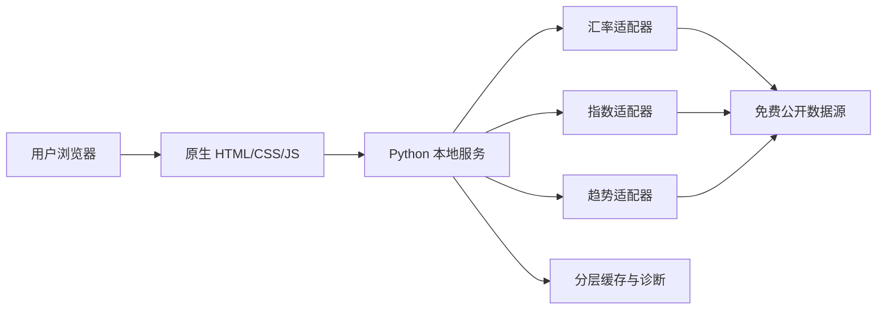

# 金融小助手 双创展示PPT讲稿

建议时长：5-6 分钟。讲述时保持节奏稳定，重点突出“全球数据、真实可用、可信兜底、零成本公开访问、交互体验前沿”。本项目不是静态展示页，而是一个可现场启动、可公网访问、可切换数据与图表模式的本地金融数据终端。

## 第 1 页：封面

各位老师好，我们展示的项目是“金融小助手”。它是一个面向普通用户和金融学习者的全球市场看板，用最轻的本地 Python 服务和原生前端，实现汇率、换汇计算、全球指数、趋势图表、市场时钟、3D 交互地球和公开访问演示。我们的目标不是做一个昂贵的交易终端，而是用第一性原理拆解金融数据看板：用户真正需要的是快、准、清楚、可信、随手可访问。

## 第 2 页：目录

接下来我会从团队分工、项目背景、产品方案、核心展示、技术架构、数据可信度、体验创新和比赛演示路径七个方面展开。整体逻辑是：先说明为什么需要这个工具，再说明我们如何把免费公开数据源、缓存兜底、图表交互和公网演示组合成一个可运行产品，最后说明它为什么有继续扩展成金融学习与市场观察平台的价值。

## 第 3 页：团队成员

我们团队分工保持不变，但组长调整为史健申。史健申负责项目统筹、需求抽象、数据可信度测试、公开访问验证、路演表达与演示路径统筹；钟浩负责产品设计、Python 后端接口、数据源适配、前端核心交互、3D 可视化与最终工程交付；曹桂涛老师负责技术路线指导、架构与创新性把关、项目规范指导。团队推进原则是：每一个功能都要能跑通，每一个数据源都要有来源说明，每一个展示点都能在现场打开验证。

## 第 4 页：项目背景

普通用户看金融市场时常遇到三个问题。第一，信息散：汇率在一个网站，指数在另一个网站，市场时间又要自己换算。第二，可信度不清：免费数据可能延迟，但很多页面不会告诉用户数据质量。第三，部署门槛高：很多项目只能在开发机上看，评委和其他同学无法直接访问。我们的项目把这些问题收敛成一个本地可运行、零成本可公开、数据质量明确标注的金融小助手。

## 第 5 页：产品主界面

主界面采用高密度金融控制台风格。顶部是全球主流市场时钟和可交互地球，中间是状态、更新时间、自动刷新和搜索控制，核心区包括汇率、换汇计算、全球指数和趋势图。它不是营销式首页，而是打开后就能使用的工作台。用户可以快速搜索货币或指数，切换暗色和浅色主题，也可以按中西方习惯切换红涨绿跌或绿涨红跌。

## 第 6 页：汇率与换汇计算

汇率模块支持 USD、CNY、EUR、JPY、GBP、HKD、AUD、CAD、CHF、SGD、KRW、INR 等常用货币。用户可以选择任意基础货币，系统会按最新可用汇率刷新卡片和换汇计算。内部保留完整数值，展示时采用高精度自适应格式，避免小额汇率被粗暴四舍五入。点击任意汇率卡片，不是跳到 API 网站，而是跳到中国银行、ECB 或相关央行等官方展示页面，数值来源和官方展示页面在 UI 上分开说明。

## 第 7 页：全球指数与三模式图表

指数模块覆盖美股三大、欧洲主要指数、日经、恒生、上证和沪深 300 等样本。每个指数展示中文名、英文名、代码、最新点位、涨跌、涨跌幅、市场时间、北京时间和数据质量。趋势图支持分时、日 K、月 K 三种模式，顶部可以全局切换，点击指数行可以打开详情大图。涨跌幅坚持使用同源字段，不用错误基准自行推算，拿不到真实 K 线时会明确标注“缓存、延迟或兜底”，避免误导。

## 第 8 页：3D 交互地球时钟

这是项目的视觉亮点。全球主流时钟不再只是静态卡片，而是一个可拖拽旋转的 3D 地球。地球中心固定，用户可以拖拽旋转，主要市场城市以高亮光点显示。点击光点会出现城市、市场、时区、日期和实时跳动时间；点击空白处取消选中；点击下方时钟卡片也会联动选中地球上的对应光点。地球优先加载 Natural Earth 1:10m 高精度边界，配合海洋、陆地、海岸线、市场弧线、星空和气辉效果，暗色和浅色模式分别优化可读性。

## 第 9 页：系统总体架构

技术上，我们没有引入重型框架。后端采用 Python 标准库实现本地 HTTP 服务，提供 /api/fx、/api/indices、/api/trends、/api/health 和 /api/diagnostics。前端采用原生 HTML、CSS、JavaScript 和本地 vendor 化的 Three.js。数据层把 Frankfurter、Sina Finance、Stooq、Yahoo 等免费公开源封装为适配器，前端只消费统一结构，降低页面逻辑复杂度。

## 第 10 页：缓存、诊断与稳定性

为了避免 20 秒自动刷新造成请求风暴，后端做了分层缓存和 stale-while-revalidate 思路。汇率和指数使用短缓存，图表趋势使用更长缓存；连续失败时保留最近成功数据并标注缓存状态。新增 /api/diagnostics 可以展示数据源最近成功时间、失败原因、缓存年龄和接口耗时。这个接口不是给普通用户看的花活，而是比赛和调试时证明系统可观测、可解释、可排障的关键能力。

## 第 11 页：体验与动画设计

前端体验遵循“快、清楚、少干扰”的原则。动画主要使用 transform、opacity、requestAnimationFrame 和 SVG 过渡，保证主题切换、卡片刷新、图表切换、地球旋转和详情展开都比较丝滑。页面尊重 prefers-reduced-motion，移动端会控制地球高度和表格滚动，避免元素重叠。暗色模式突出科技感，浅色模式强调阅读和展示，红绿涨跌偏好让不同文化习惯的用户都能快速理解行情。

## 第 12 页：数据可信度与边界

金融产品最重要的是不能装作自己比数据源更权威。我们使用免费公开数据源，因此明确标注“实时、延迟、缓存、兜底”等质量状态，并在页面保留免责说明：数据仅用于学习和市场观察，不构成投资建议。指数详情和汇率卡片都提供来源跳转，CNY 相关汇率优先跳中国银行外汇牌价，国际参考汇率跳 ECB 或相关央行页面，指数跳到官方或可信来源详情页。

## 第 13 页：创新价值

项目的创新不是单点炫技，而是把多个真实约束合在一起解决。第一，零付费 API 条件下仍然提供可用的全球市场看板；第二，数据质量在界面上显式表达，不混淆真实数据和兜底数据；第三，用 3D 地球把市场时间和空间位置结合起来，降低跨时区理解成本；第四，本地运行加 Cloudflare Quick Tunnel，使作品能够以 0 成本快速公开演示；第五，诊断接口和缓存策略让项目从“能看”升级为“能解释为什么这样显示”。

## 第 14 页：进度与计划

目前项目已经完成本地服务、汇率、换汇计算、全球指数、趋势图三模式、暗浅主题、红绿偏好、搜索、20 秒自动刷新、3D 地球、官方来源跳转、诊断接口和公开访问脚本。短期计划是继续补充更多稳定指数源、增加更多市场和商品品类；中期可以加入自选列表、历史对比、风险提示和学习卡片；长期可以演进为面向金融学习场景的轻量市场实验室。

## 第 15 页：展示路径

现场展示可以按五条线展开。第一，打开首页展示地球和市场时钟，拖拽并点击光点。第二，切换主题和红绿习惯，证明交互偏好可配置。第三，切换基础货币并做换汇计算，点击卡片进入官方展示页。第四，查看全球指数，切换分时、日 K、月 K，并打开详情图。第五，访问 /api/diagnostics，说明数据源、缓存、耗时和失败兜底都可观测。最后用公开访问脚本生成 trycloudflare.com 链接，让其他人直接打开体验。

## 第 16 页：致谢

以上就是我们的项目展示。用一句话总结：金融小助手用最低成本做出一个可运行、可公开、可解释、可交互的全球市场控制台。它不把免费数据包装成交易级终端，而是把数据来源、质量状态、跨时区时间、趋势图和公开访问都摆到用户面前，让普通用户真正看得懂、用得上、查得到来源。谢谢各位老师。
