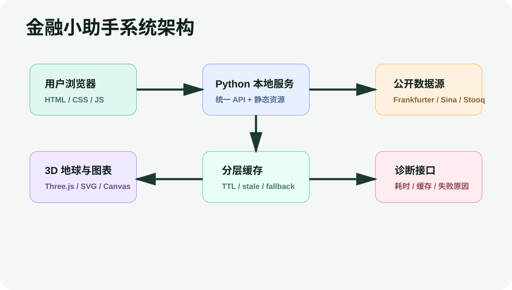

# 金融小助手 答辩 Q&A 50 题

使用建议：回答时先给结论，再给依据，最后落到项目取舍。遇到老师追问局限，先承认边界，再说明当前阶段为什么这样做合理，以及下一步如何增强。

## 一、项目定位与需求价值

### 01. 老师可能问：你们这个项目一句话解决什么问题？

**回答：**  
金融小助手解决的是普通用户看全球市场时“信息分散、时间难换算、来源不清楚、演示不容易公开”的问题。它把汇率、换汇计算、全球指数、趋势图、市场时钟和数据质量说明放到一个本地可运行的控制台里，并能通过 Cloudflare 临时公网链接让别人直接访问。

**追问：**  
它不是交易软件，而是市场观察和金融学习工具；我们把边界说清楚，数据仅用于学习和展示，不构成投资建议。

### 02. 老师可能问：为什么选择金融市场看板这个方向？

**回答：**  
汇率和指数是最容易被普通用户接触、也最容易产生跨网站查询成本的金融信息。这个方向既能体现实时数据处理、可视化、缓存和异常兜底，也适合比赛现场演示，因为评委能立刻看懂功能是否真的跑通。

**追问：**  
我们先聚焦汇率和主要指数，后续可以扩展商品、债券、基金和自选组合。

### 03. 老师可能问：项目和普通网页行情页相比有什么不同？

**回答：**  
普通行情页通常只展示一类数据，而我们把跨时区时钟、3D 地球、汇率、官方来源跳转、指数图表、数据质量标签和诊断接口组合成完整体验。更重要的是，项目可本地运行、可公网临时分享，适合教学、展示和轻量市场观察。

**追问：**  
差异点不是信息堆叠，而是把数据可信度、交互和部署方式一起做成闭环。

### 04. 老师可能问：为什么强调 0 成本公开访问？

**回答：**  
比赛和真实展示时，最怕作品只能在开发机上看。我们通过本地 Python 服务加 Cloudflare Quick Tunnel，让作品不买服务器、不买域名也能生成公网访问链接。只要电脑和网络不断开，别人就能通过链接体验产品。

**追问：**  
这不是长期商业部署方案，而是最快、最低成本、最适合比赛现场的展示方案。

### 05. 老师可能问：你们如何证明不是静态网页？

**回答：**  
页面数据由 Python 后端接口动态提供，包含 /api/fx、/api/indices、/api/trends、/api/diagnostics 等接口。前端会自动刷新、切换基础货币、请求趋势图数据、更新世界时钟读秒，并支持 3D 地球交互。

**追问：**  
如果断网或数据源失败，页面会显示缓存或兜底状态，这也说明它有真实数据链路。

## 二、团队与分工

### 06. 老师可能问：团队成员具体分工是什么？

**回答：**  
史健申作为组长，负责项目统筹、需求抽象、数据可信度测试、公开访问验证、路演表达与演示路径统筹；钟浩负责产品设计、Python 后端接口、数据源适配、前端核心交互、3D 可视化与最终工程交付；曹桂涛老师负责技术路线指导、架构与创新性把关、项目规范指导。

**追问：**  
分工覆盖了需求、实现、测试、展示和指导，不是只做页面包装。

### 07. 老师可能问：指导老师在项目中起到什么作用？

**回答：**  
指导老师主要帮助我们把作品从一个可运行工具提升为结构清晰、创新点明确、边界严谨的参赛项目。她关注技术路线是否合理、材料表达是否规范、项目价值是否能被评委理解。

**追问：**  
核心实现由学生团队完成，指导老师负责方向和规范把关。

### 08. 老师可能问：为什么不用 React、Vue 这类框架？

**回答：**  
本项目的第一目标是本地启动快、交付可靠、评委无需安装复杂环境。原生 HTML/CSS/JS 足够完成交互，而且减少构建步骤和依赖风险。Three.js 作为 3D 渲染库被本地 vendor 化，避免 CDN 不稳定。

**追问：**  
这不是排斥框架，而是在这个场景下选择最稳、最轻的技术路径。

## 三、数据、后端与 API 可信度

### 09. 老师可能问：后端为什么用 Python 标准库？

**回答：**  
用户机器上 node/npm 不稳定，而项目已经有 portable Python。用 Python 标准库实现 HTTP 服务可以减少安装依赖，双击 bat 就能启动。后端承担数据源适配、缓存、诊断和静态资源服务，职责清晰。

**追问：**  
如果未来规模扩大，可以平滑迁移到 FastAPI 或 Flask，但比赛版不依赖它们。

### 10. 老师可能问：你们有哪些 API？

**回答：**  
核心 API 包括 /api/fx 获取汇率，/api/indices 获取指数，/api/trends 获取分时、日 K、月 K 趋势，/api/health 做健康检查，/api/diagnostics 输出数据源状态、缓存年龄、接口耗时和失败原因。

**追问：**  
这些接口使前端不是写死数据，而是消费统一的后端数据结构。

### 11. 老师可能问：汇率数据来源是什么？

**回答：**  
汇率数值主要来自 Frankfurter 等免费公开源，页面同时把官方展示入口和 API 数据来源分开说明。CNY 相关货币对点击后跳中国银行外汇牌价，国际参考汇率跳 ECB 或相关央行页面。

**追问：**  
API 用来计算，官方页面用来核验和展示，两者在 UI 上不混淆。

### 12. 老师可能问：为什么汇率点击不直接跳 API？

**回答：**  
普通用户点击卡片希望看到权威解释，而不是开发者 API 文档。因此我们新增官方跳转逻辑：涉及人民币的跳中国银行，欧元参考汇率跳 ECB，其它货币尽量跳央行或监管机构页面。

**追问：**  
这提升了可信度，也符合金融信息产品应该尊重权威来源的原则。

### 13. 老师可能问：指数数据来源是什么？

**回答：**  
指数模块采用 Sina Finance、Stooq、Yahoo 等公开源的适配器组合。不同市场的数据稳定性不同，所以页面会显示实时、延迟、缓存或兜底等质量标签，并提供来源链接。

**追问：**  
我们不使用 ETF 或相近资产冒充指数，拿不到真实 K 线会明确提示。

### 14. 老师可能问：如何保证涨跌幅不算错？

**回答：**  
我们在后端约束：指数涨跌和涨跌幅优先使用数据源返回的同源字段，不用错误基准自行推算。早期版本发现过上证等指数点位对但涨跌幅不一致的问题，后续已按同源字段原则修正。

**追问：**  
当来源没有可靠涨跌幅时，页面宁愿标注质量问题，也不伪造精确结果。

### 15. 老师可能问：免费数据源会不会不可靠？

**回答：**  
会有短时不可用或延迟，这正是我们设计数据质量标签、缓存和诊断接口的原因。系统不会假装免费源有交易级 SLA，而是把最近成功时间、失败原因和缓存状态展示出来。

**追问：**  
项目价值在于真实面对限制，而不是隐藏限制。

### 16. 老师可能问：缓存策略是什么？

**回答：**  
后端对汇率、指数和趋势做分层缓存。汇率和指数是短缓存，适合 20 秒刷新；趋势图缓存更长，避免频繁请求历史数据。同一刷新周期尽量复用结果，连续失败时保留最近成功数据。

**追问：**  
这样能减少请求风暴，也能在网络抖动时保持页面可用。

### 17. 老师可能问：什么是 stale-while-revalidate 思路？

**回答：**  
意思是当缓存还可用或刚过期时，先把旧数据给用户看，再在后台或下一次请求中刷新。用户不会因为某个源短暂卡住而看到整页崩掉。

**追问：**  
我们在本地 Python 服务中用轻量方式实现这一思想，而不是引入复杂缓存中间件。

### 18. 老师可能问：诊断接口有什么意义？

**回答：**  
/api/diagnostics 可以显示服务版本、缓存状态、数据源最近成功和失败、接口耗时、公开演示建议等。比赛现场如果老师问数据是否真能跑，我们可以直接打开诊断接口验证。

**追问：**  
它把系统内部状态透明化，是工程可信度的一部分。

## 四、前端体验、图表与 3D 地球

### 19. 老师可能问：3D 地球的技术实现是什么？

**回答：**  
地球使用本地 vendor 化 Three.js 渲染，城市光点根据经纬度贴在球体表面，拖拽通过旋转 globe group 实现，点击用 Raycaster 做拾取，tooltip 每秒与世界时钟共用时间格式化逻辑更新。

**追问：**  
页面隐藏时减少渲染，移动端控制画布高度，保证体验稳定。

### 20. 老师可能问：为什么要做 3D 地球？

**回答：**  
金融市场天然和时区、地理位置有关。只展示文字时钟很难形成空间感，而 3D 地球能让北京、纽约、伦敦、法兰克福、东京、香港这些市场位置和时间建立联系。

**追问：**  
它不是装饰，而是把跨时区理解成本降下来。

### 21. 老师可能问：地球精度如何处理？

**回答：**  
比赛版优先加载 Natural Earth 1:10m 边界数据，避免使用随手画的低精度板块。加载前不会展示旧低精度轮廓，失败时才进入可说明的 fallback 状态。

**追问：**  
我们承认浏览器里不可能做到地球物理级 1:1，但在前端可交互展示中采用了公开高精度边界数据。

### 22. 老师可能问：点击空白取消选中是怎么做的？

**回答：**  
地球点击事件会先用 Raycaster 判断是否命中市场光点，如果没有命中，就清空 selectedClockIndex 并隐藏 tooltip，同时更新状态标签为未选中。

**追问：**  
这个细节能让交互符合用户直觉。

### 23. 老师可能问：图表为什么要支持分时、日 K、月 K？

**回答：**  
不同用户的问题不一样。分时看当天波动，日 K 看近期趋势，月 K 看长期方向。全局切换可以快速比较所有指数，点击单个指数进入详情可以看大图。

**追问：**  
对拿不到稳定 K 线的数据，页面会标注兜底原因。

### 24. 老师可能问：图表是用什么库做的？

**回答：**  
核心图表使用原生 SVG/Canvas 思路实现，没有引入重型图表框架。这样启动快、体积小，也方便根据数据质量显示不同标识。

**追问：**  
如果未来要做更复杂指标，可以考虑引入 ECharts 或 TradingView Lightweight Charts。

### 25. 老师可能问：暗色和浅色模式为什么重要？

**回答：**  
金融看板常常需要长时间查看，暗色模式有科技感并降低眩光，浅色模式适合汇报和阅读。我们把主题切换做成用户偏好，并让地球、图表、卡片和涨跌颜色一起适配。

**追问：**  
主题不是换背景色，而是完整视觉系统。

### 26. 老师可能问：为什么支持红涨绿跌和绿涨红跌？

**回答：**  
中国用户习惯红涨绿跌，很多海外市场习惯绿涨红跌。金融工具如果只支持一种习惯，会增加理解成本。我们允许用户切换，并把偏好应用到指数、汇率和图表。

**追问：**  
这是尊重用户认知习惯的细节。

### 27. 老师可能问：搜索功能覆盖什么？

**回答：**  
搜索可以按货币、指数、代码和中文名过滤内容。用户不需要滚动查找某个市场，直接输入 USD、上证、Nasdaq 或 CNY 就能定位。

**追问：**  
对高密度看板来说，搜索是核心效率功能。

### 28. 老师可能问：自动刷新为什么是 20 秒？

**回答：**  
早期是 60 秒，后来根据使用反馈改成 20 秒。20 秒在演示和准实时观察中更有反馈感，同时通过缓存和请求合并避免造成数据源压力。

**追问：**  
免费数据源本身可能延迟，所以刷新频率不是承诺交易级实时。

### 29. 老师可能问：如何避免请求风暴？

**回答：**  
前端合并同一轮刷新中的请求，后端使用缓存和超时控制，趋势图缓存时间更长，失败时不无限重试。这样即使页面自动刷新，也不会每 20 秒对每个外部源发大量请求。

**追问：**  
服务端日志也会避免把客户端中断当成严重错误堆栈刷屏。

## 五、部署、安全与公开访问

### 30. 老师可能问：公开访问脚本做了什么？

**回答：**  
公开访问金融小助手.bat 会先启动本地 Python 服务，再拉起 Cloudflare Quick Tunnel，终端里出现 trycloudflare.com 链接后，把链接发给别人即可访问。

**追问：**  
窗口、电脑和网络必须保持运行，关闭后链接失效。

### 31. 老师可能问：为什么别人可能看到旧地球？

**回答：**  
浏览器或公网边缘可能缓存旧的 app.js、CSS 或地球数据。比赛版增加资源版本号和 no-store 缓存头，并明确检查 world-land-10m.json 是否能通过公网加载。

**追问：**  
如果仍异常，可以让对方强制刷新或重新生成公网链接。

### 32. 老师可能问：安全边界是什么？

**回答：**  
项目不做登录，不保存隐私，不收集用户数据。公网访问只是把本机演示服务临时暴露出去，适合比赛展示，不适合作为长期生产服务。

**追问：**  
如果长期上线，需要正式服务器、HTTPS 域名、访问控制和审计。

### 33. 老师可能问：为什么没有接付费行情 API？

**回答：**  
比赛版目标是 0 成本、可复现、快速交付。付费 API 会提高门槛，也会让评委难以复现。我们选择免费公开源并明确标注数据质量。

**追问：**  
商业化版本可以接入合规付费源提升实时性和 SLA。

### 34. 老师可能问：项目最大的技术难点是什么？

**回答：**  
难点不在单个页面，而在多个约束同时成立：免费数据源不稳定、本地无 node/npm、要公网演示、要高交互体验、还要不误导用户。我们通过 Python 标准库、原生前端、缓存、诊断和数据质量标签把这些约束统一起来。

**追问：**  
这体现的是工程整合能力。

### 35. 老师可能问：项目有哪些创新点？

**回答：**  
一是零成本可公开的金融数据终端；二是数据质量可视化和诊断接口；三是 3D 地球与市场时钟联动；四是红绿习惯和主题双偏好；五是汇率官方来源跳转和 API 数据来源分离。

**追问：**  
创新点都能在现场点开验证。

### 36. 老师可能问：相比商业金融终端差距在哪里？

**回答：**  
商业终端有付费实时数据、专业指标、交易接口和合规服务，我们当前没有这些。我们的定位是学习、展示和轻量观察，不替代交易终端。

**追问：**  
承认边界能让项目更可信。

### 37. 老师可能问：如果数据源全部不可用怎么办？

**回答：**  
页面会显示错误、缓存或不可用状态，/api/diagnostics 会记录失败原因。汇率和指数尽量使用最近成功缓存，趋势图无法获取时会显示明确兜底说明。

**追问：**  
不会用假数据冒充实时数据。

### 38. 老师可能问：项目是否支持移动端？

**回答：**  
支持。布局会在窄屏下调整，地球高度固定，卡片和表格避免横向溢出，触控可拖拽地球和查看图表 tooltip。

**追问：**  
移动端是金融信息快速查看的重要场景。

### 39. 老师可能问：性能优化做了哪些？

**回答：**  
前端动画优先使用 transform 和 opacity，地球用 requestAnimationFrame，页面隐藏时减少渲染；后端用缓存、超时和请求合并减少等待；资源本地化避免 CDN 失败。

**追问：**  
这些优化保证比赛现场操作更流畅。

### 40. 老师可能问：为什么说项目可维护？

**回答：**  
后端数据源被封装为适配器，API 输出统一结构；前端渲染按模块分为汇率、指数、趋势、地球、偏好；诊断接口能看到数据源状态。

**追问：**  
后续换数据源或增加品类不需要重写整页。

### 41. 老师可能问：作品安装方式是什么？

**回答：**  
双击启动金融小助手.bat 即可本地启动；浏览器访问 http://127.0.0.1:18765。公开演示时双击公开访问金融小助手.bat，等待 trycloudflare.com 链接出现。

**追问：**  
不要求评委安装 node/npm 或数据库。

## 六、创新创业价值与未来规划

### 42. 老师可能问：演示时最推荐展示哪几步？

**回答：**  
先拖拽 3D 地球并点击城市光点，再切换主题和红绿习惯；然后切基础货币、点汇率官方来源；接着查看指数和图表三模式；最后打开 diagnostics 说明系统可信度。

**追问：**  
这条路径能覆盖视觉、数据、交互和工程能力。

### 43. 老师可能问：项目现在有哪些已知限制？

**回答：**  
免费数据源可能延迟或短时不可用；Cloudflare 临时链接关闭后失效；当前没有用户账号和自选组合；图表指标还比较轻量。

**追问：**  
这些限制不会影响比赛版演示，但未来产品化需要继续增强。

### 44. 老师可能问：未来如何商业化？

**回答：**  
可以向金融学习社群、财经课程、校园社团和小型研究团队提供轻量看板；商业路径包括自选组合、学习卡片、数据报告、私有化部署和合规数据源接入。

**追问：**  
前提是明确非投顾边界，并接入更可靠的数据服务。

### 45. 老师可能问：如果要长期上线怎么做？

**回答：**  
需要把临时公网链接换成正式云服务器和域名，加入访问控制、日志审计、HTTPS、稳定数据源和错误监控。Python 标准库服务可以升级为 FastAPI，前端仍可复用。

**追问：**  
比赛版已经把模块边界打好。

### 46. 老师可能问：这个项目为什么适合创新创业比赛？

**回答：**  
它有真实需求、可运行产品、技术亮点、成本优势和明确边界。评委不只听概念，可以现场访问、点击、刷新、看诊断接口，验证它确实是一个完整系统。

**追问：**  
可展示性和工程可信度是它的竞争力。

### 47. 老师可能问：如果评委质疑数据不是交易级实时，怎么回答？

**回答：**  
我们会直接承认：比赛版使用免费公开源，不承诺交易级实时，也不提供投资建议。我们的价值是把数据源、质量状态、缓存和官方跳转透明呈现。

**追问：**  
不夸大数据能力，反而体现了金融产品应有的严谨。

### 48. 老师可能问：如果评委问为什么不用数据库？

**回答：**  
当前数据主要是实时查询和短期缓存，不需要持久化用户数据。用内存缓存和本地 JSON/静态资源就能满足比赛版目标，减少部署负担。

**追问：**  
未来加入自选组合、用户偏好云同步时可以引入 SQLite 或 PostgreSQL。

### 49. 老师可能问：如果网络断了还能用吗？

**回答：**  
本地页面和已有缓存可以显示，但外部行情无法更新，页面会标注缓存或不可用。公开访问链接也依赖电脑网络，因此网络断开后别人无法访问。

**追问：**  
这是零成本临时公网方案的自然边界。

### 50. 老师可能问：项目中最能体现第一性原理的地方是什么？

**回答：**  
我们把金融看板拆成最基本需求：用户要看什么、数据从哪里来、什么时候更新、可信度如何、打不开时怎么办、如何让别人访问。每个功能都围绕这些问题做取舍，而不是堆砌框架。

**追问：**  
这也是项目从静态网页升级成完整产品的主线。
